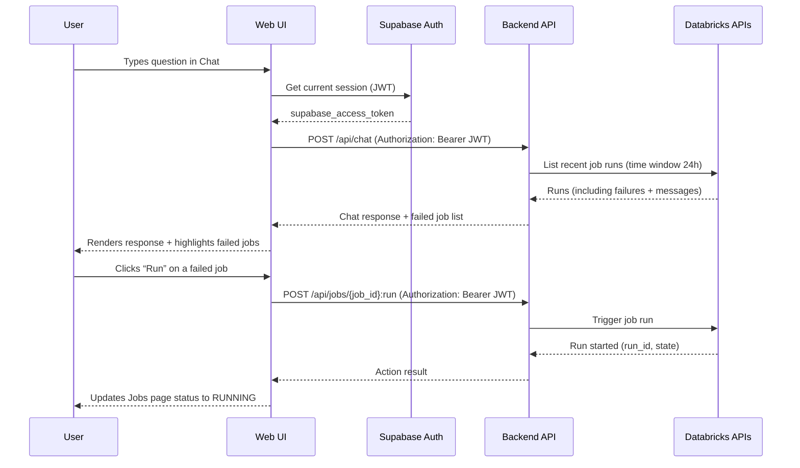

# DataPilot — Databricks Automation Dashboard + Chat

DataPilot is a web UI + backend control plane for monitoring and automating Databricks (Jobs, DLT Pipelines, and Clusters) through both dashboards and a chat-driven workflow.

This README describes the **architecture as the frontend is designed to work** (canonical frontend: [frontend/src](frontend/src)).

## What’s in this repo

- **Frontend (Web UI):** Vite + React + TypeScript in [frontend/src](frontend/src)
  - Pages for Chat/Jobs/Pipelines/Clusters/dbt/Alerts/Logs/Settings
  - Supabase browser client configuration in [frontend/src/lib/supabase.ts](frontend/src/lib/supabase.ts)
- **Backend (Control plane):** Python in [backend/src](backend/src)
  - Loads environment in [backend/src/config/env.py](backend/src/config/env.py)
  - MCP scaffolding in [backend/src/server/mcp_server.py](backend/src/server/mcp_server.py)
- **Database/Auth (Supabase):** schema migrations in [frontend/supabase/migrations](frontend/supabase/migrations)

---

## Architecture (aligned to the frontend design)

The frontend is built as an **authenticated web dashboard** that calls a **backend HTTP API**. The backend orchestrates Databricks operations and (optionally) persists snapshots/history to Supabase.

### Data flow diagram
- <u>High Level View</u> 


- <u>Detailed View</u>


- <u>Orchestrator Deep Dive</u>
 (optional but strong for interviews).png>)

### Components and responsibilities

#### 1) Web UI (React)
- **Purpose:** Render live dashboards and trigger actions.
- **Key parts:**
  - App shell/layout: [frontend/src/components/Layout.tsx](frontend/src/components/Layout.tsx), [frontend/src/components/Sidebar.tsx](frontend/src/components/Sidebar.tsx), [frontend/src/components/TopNav.tsx](frontend/src/components/TopNav.tsx)
  - Feature pages: [frontend/src/pages](frontend/src/pages)
  - Supabase client: [frontend/src/lib/supabase.ts](frontend/src/lib/supabase.ts)
- **Runtime behavior:**
  - Reads the current Supabase session.
  - Calls backend endpoints with `Authorization: Bearer <supabase_access_token>`.
  - Updates UI state with returned JSON.

#### 2) Supabase Auth
- **Purpose:** Browser-safe authentication (email/password) and session issuance.
- **What the UI uses:** the Supabase session access token (JWT) to authenticate backend API calls.
- **Security boundary:** the frontend must never hold Databricks credentials.

#### 3) Backend Control Plane API (Python)
- **Purpose:** Single, secure entry point for all “live” operations the UI needs.
- **Responsibilities:**
  - Verify Supabase JWT and enforce authorization/workspace scope.
  - Perform Databricks operations using server-side credentials.
  - Optionally persist snapshots and chat history to Supabase.
  - Return UI-ready JSON (lists, detail payloads, action results).
- **Current scaffolding:** configuration in [backend/src/config/env.py](backend/src/config/env.py), server bootstrap in [backend/src/main.py](backend/src/main.py).

#### 4) Orchestrator (Chat → Actions)
- **Purpose:** Turn a chat prompt into one or more safe operations.
- **Typical steps:**
  1. Parse intent (e.g., “show failed jobs last 24h”)
  2. Execute one or more Databricks queries/actions
  3. Format a response for the chat timeline
  4. Optionally return structured objects to update dashboards

#### 5) Databricks Workspace APIs
- **Purpose:** Source of truth for jobs, runs, pipelines, clusters.
- **How it’s accessed:** backend uses Databricks SDK/REST with PAT or OAuth.

#### 6) Supabase Postgres (optional persistence)
- **Purpose:** Store UI-friendly snapshots/history (jobs, clusters, pipelines, alerts) and chat logs.
- **Schema migration:** [frontend/supabase/migrations/20260406075701_create_datapilot_schema.sql](frontend/supabase/migrations/20260406075701_create_datapilot_schema.sql)

---

## API contract (what the frontend expects)

The UI feature pages map cleanly to a minimal REST-style contract:

- Jobs
  - `GET /api/jobs`
  - `GET /api/jobs/{job_id}/runs`
  - `POST /api/jobs/{job_id}:run`
- Pipelines (DLT)
  - `GET /api/pipelines`
  - `POST /api/pipelines/{pipeline_id}:start`
  - `POST /api/pipelines/{pipeline_id}:stop`
- Clusters
  - `GET /api/clusters`
  - `POST /api/clusters/{cluster_id}:start`
  - `POST /api/clusters/{cluster_id}:terminate`
- Alerts
  - `GET /api/alerts`
  - `POST /api/alerts/{alert_id}:ack`
- Chat
  - `POST /api/chat`

Each endpoint returns JSON matching the frontend types used across pages/components.

---

## Example use case (end-to-end)

### Scenario: “What jobs failed in the last 24 hours?” then rerun one



---

## Quick setup (local development)

### 1) Backend (Python HTTP API)

```bash
cd backend
python -m venv .venv
.\.venv\Scripts\Activate.ps1
pip install -r requirements.txt
copy .env.example .env.local
# edit .env.local (use .env.example as reference)
python -m src.main
```

Backend default: `http://127.0.0.1:8080`.

### 2) Frontend (Vite + React)

```bash
cd frontend
npm install
copy .env.example .env.local
# edit .env.local (use .env.example as reference)
npm run dev
```

Frontend default: `http://localhost:5173`.

### 3) Supabase (optional)
If you want the database tables locally/in your Supabase project, apply the SQL migrations in [frontend/supabase/migrations](frontend/supabase/migrations).

> Note: `.env.local` files are ignored by git.

---

## License

MIT License
